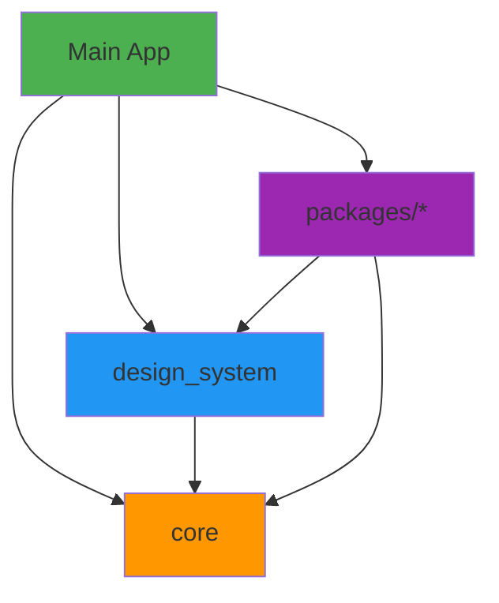

# Blue Bird CLI 🐦

[![style: very good analysis][very_good_analysis_badge]][very_good_analysis_link]
[![License: MIT][license_badge]][license_link]

**Build scalable Flutter apps with confidence.**

Blue Bird CLI generates production-ready Flutter projects with clean architecture, workspace management, and automated dependency injection. Choose from lite templates for small apps or complex multi-package architectures for enterprise-scale applications.

<p align="center">

</p>

_Inspired by [Very Good CLI][very_good_cli_link] 🤖_

---

## Installation 🚀

```sh
dart pub global activate blue_bird_cli
```

## Quick Start

```sh
# Create a lite app (small to medium projects)
blue_bird create lite_app -t flutter_lite

# Create a full-scale app (complex, enterprise projects)
blue_bird create full_app

# Add a feature package to an existing project
blue_bird create my_feature -t flutter_package -o "full_app/packages"
```

---

## Templates

### 🪶 Flutter Lite
**Perfect for small to medium-sized projects**

A streamlined single-app structure with clean architecture, ideal for apps that need organization without the complexity of multi-package workspaces.

```sh
blue_bird create lite_app -t flutter_lite --org com.mycompany
```

**Structure:**
```
lite_app/
├── lib/
│   ├── main.dart
│   └── src/
│       ├── config/         # DI, routes, l10n, theming
│       ├── data/           # Repositories, data sources, models
│       ├── domain/         # Entities, use cases, repository interfaces
│       └── presentation/   # Pages, widgets, view models
├── assets/
└── test/
```

### 🏗️ Flutter Project
**Built for complex, scalable applications**

A comprehensive multi-package architecture with clean architecture patterns, perfect for large teams and enterprise apps.

```sh
blue_bird create full_app
```

**Structure:**
```
full_app/
├── core/              # Foundation layer
├── design_system/     # UI system
├── packages/          # Feature packages
│   └── bb_example_package/
│   └── ...
└── lib/               # Main app
```

### 📦 Flutter Package
**Modular feature development**

Generate feature packages with clean architecture (data, domain, presentation layers) that automatically integrate with your workspace.

```sh
cd full_app/packages
blue_bird create my_feature -t flutter_package
```

**Auto-configured:**
- ✅ Added to workspace
- ✅ Added to dependencies
- ✅ DI configuration injected

---

## Architecture & Dependencies

Blue Bird enforces a clear dependency hierarchy to maintain scalability:



**Dependency Rules:**
- **Main App** → Can use all packages
- **design_system** → Can use core only
- **core** → No internal dependencies (foundation layer)
- **packages/** → Can use core and design_system
- **packages/** → ❌ Cannot depend on each other (no cyclic dependencies)

This ensures maintainability and prevents circular dependencies as your app grows.

---

## Package Structure

Feature packages follow clean architecture with three distinct layers:

**Domain Layer** (Business Logic)
- Entities, repositories interfaces, use cases

**Data Layer** (Implementation)
- Repository implementations, data sources, models

**Presentation Layer** (UI)
- Pages, widgets, state management (Cubit/BLoC)

Example: `bb_example_package`
```
bb_example_package/
├── lib/src/
│   ├── domain/
│   ├── data/
│   ├── presentation/
│   └── config/di/
```

---

## Commands

### Create Projects & Packages

```sh
# Lite template
blue_bird create lite_app -t flutter_lite

# Full project (default)
blue_bird create full_app

# Feature package
blue_bird create my_package -t flutter_package

# With custom organization
blue_bird create my_app --org com.example.myapp

# All platforms are added by default, remove them like this
blue_bird create my_app -t flutter_lite --android false --ios false
```

### Update CLI

```sh
blue_bird update
```

### Help

```sh
blue_bird --help
blue_bird create --help
```

---

## Features

✨ **Workspace Management** - Automatic workspace configuration  
🔧 **Auto DI Integration** - Dependencies injected automatically  
📐 **Clean Architecture** - Domain, data, presentation layers  
🎨 **Design System** - Centralized theming and components  
🧪 **Test Ready** - Pre-configured testing structure  
📦 **Modular** - Feature-based package organization  
🔄 **Melos Compatible** - Multi-package development ready  

---

## License

[MIT][license_link]

---

[license_badge]: https://img.shields.io/badge/license-MIT-blue.svg
[license_link]: https://opensource.org/licenses/MIT
[very_good_analysis_badge]: https://img.shields.io/badge/style-very_good_analysis-B22C89.svg
[very_good_analysis_link]: https://pub.dev/packages/very_good_analysis
[very_good_cli_link]: https://github.com/VeryGoodOpenSource/very_good_cli